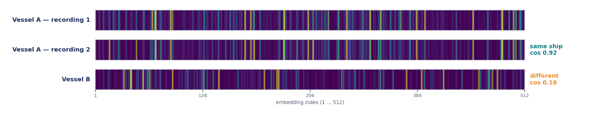
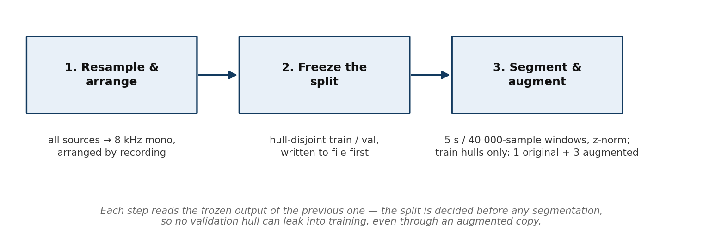
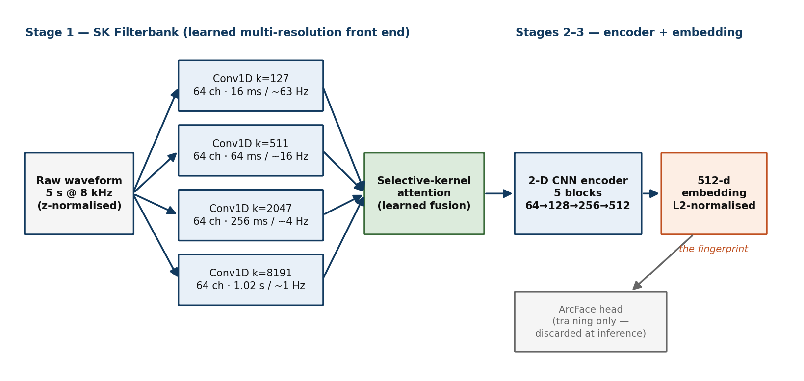
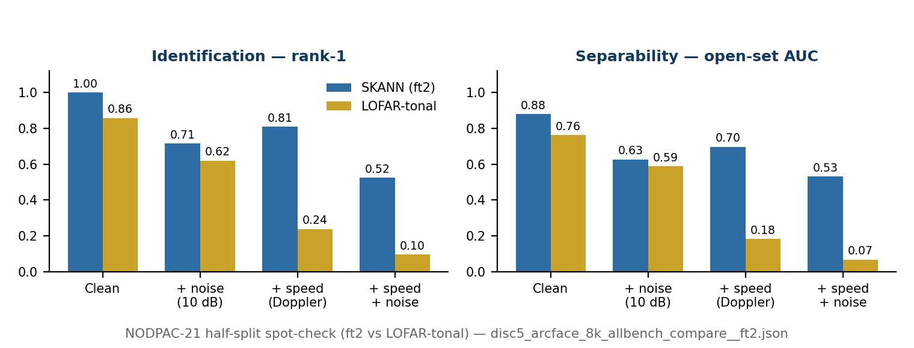

# DISC5 — SKANN Vessel Re-Identification
### Technical Documentation — Training, Data, Preprocessing, Model & Deployment

**Scope.** This document describes the delivered DISC5 acoustic vessel re-identification system end to end: what it does, the data it was trained on, how each recording was preprocessed and why, the augmentation regime, the model architecture, the training methodology and checkpoint lineage, the evaluation results, and how the delivered application is installed and used. It is written to be self-contained and to double as the source material for the project's repositories.

The delivered model is the **ft2** checkpoint `disc5_arcface_8k_ft2_ep003.pth` (lineage: base → ftONC → ft2, detailed in §6). At inference only the backbone runs; the training classification head is discarded.

---

## 1. System overview

### 1.1 What the system does
DISC5 **re-identifies individual vessels** from passive-sonar recordings. Given a recording of an unknown contact, it produces a compact acoustic **fingerprint** and matches it against a **gallery** of previously enrolled vessels, returning a ranked shortlist of the most similar known hulls.

This is **re-identification**, not classification:
- The task is to identify the *individual hull* (which specific ship), not the *type* (cargo / tanker / ferry). It must separate two different cargo ships, not merely label both "cargo."
- It is **open-set**: the answer is "matched vessel X" or "not in the database." Architecturally it is the same family of problem as speaker or face verification.
- The model has **frozen weights**; only the **gallery grows** as new vessels are enrolled. Enrolling a new hull is a single forward pass — no retraining, no new class.

### 1.2 The two methods shown side by side
Every query is scored by two independent methods, presented in parallel:
- **SKANN** — a learned neural fingerprint: a 512-number embedding of the sound. Similarity is cosine (higher = more alike).
- **LOFAR-tonal** — the established narrowband-line method (the incumbent workflow), shown as a second opinion. Similarity is the fraction of matched tonal lines.

The two are **never fused into a single number.** They are shown together; agreement between them (both ranking the same vessel near the top) is surfaced but not combined, because a fixed fusion was measured to *hurt* under speed/Doppler (§7). The two scales are not comparable to each other — each is read against its own ranking.

### 1.3 Relationship to the incumbent NODPAC workflow
The current NODPAC procedure is manual: separate a target by bearing, export a WAV, run LOFAR and DEMON analysis in the Signature Analyser, hand-place harmonic markers, write tonal values to CSV, and run a similarity search against the LOFAR database (LDBMS). SKANN automates the fingerprinting and matching step: instead of an analyst reading and transcribing narrowband lines by eye, the network computes a fingerprint directly from the waveform, and matching is a cosine comparison against the gallery. The LOFAR-tonal column preserves the familiar line-based view as an independent cross-check.

---

## 2. Training data

Four sources are used, in three distinct roles.

| Source | Role | Identity labels | Notes |
|---|---|---|---|
| **IARA** | Base training + primary validation | Yes (MMSI/IMO) | Large multi-identity hydrophone corpus; the backbone of the identity set |
| **ShipsEar** | Base training + validation | Yes | Spanish coastal recordings; ferries, RORO, ocean liner, and others |
| **ONC** (Ocean Networks Canada) | Cross-hardware fine-tuning | Yes | A second, independent hydrophone observatory — used to test and improve transfer across recording hardware |
| **NODPAC-21** | Target-hardware spot-check **only** | No metadata | 14 merchant + 7 decommissioned vessels on NODPAC's own hardware; **never used in training** |

### 2.1 Base identity set (IARA + ShipsEar)
The base model is trained on IARA + ShipsEar, keyed on vessel identity (MMSI/IMO). After preprocessing and the hull-disjoint split (§3, §6):

- **646 training hulls**, **49 validation hulls** (40 IARA + 9 ShipsEar), **zero overlap** — the split is by *hull*, not by clip percentage, so a validation vessel appears in no training data whatsoever (not even an augmented copy).
- **322,159** segment tensors total: **314,520 train / 7,639 validation**, each `(1, 1, 40000)` float32.
- 500 of the 646 training hulls are **singletons** (a single recording) — the identity set is deliberately singleton-heavy, which drives one of the training choices (a gentler ArcFace margin; §6).

Validation vessels each have **at least two recordings of verifiable identity**, so that same-vessel vs different-vessel comparisons can be constructed for the go/no-go metric.

### 2.2 Cross-hardware set (ONC)
ONC is a *different* hydrophone network from IARA/ShipsEar, which makes it the right instrument for the project's single biggest risk: whether a fingerprint learned on one set of hardware transfers to another. ONC is used only for fine-tuning and for an unseen-vessel test:
- A 15-vessel multi-passage ONC set is split **8 enrolled (trained) / 7 held out**. The **7 held-out vessels are never trained on** and serve as the unseen cross-hardware verdict.
- The broader ONC fine-tune (ft2) draws on ~90 ONC vessels (multi-passage plus single-passage), with the same 7 vessels still held out.

### 2.3 Target set (NODPAC-21)
The NODPAC-21 set (14 merchant + 7 decommissioned = 21 vessels) is recorded on NODPAC's own hardware and carries **no metadata**. It is used strictly as a **target-hardware spot-check**, never for training and never as the primary proof of re-identification performance. Because it has no identity metadata, labelled same/different pairs cannot be constructed on it, so the value-add comparison (embedding vs tonal baseline) is measured on IARA, not here.

---

## 3. Preprocessing — and why

The guiding philosophy, carried over from the earlier PS12 work, is **strip the recording-chain artefacts** so the model keys on *vessel identity* rather than on *which hydrophone / channel* made the recording. Three preprocessing decisions implement this, applied identically to every source.

### 3.1 Resample to 8 kHz mono
All audio, from every source, is resampled to **8 kHz mono** as the first step. NODPAC's discriminating tonal information sits below ~2 kHz; 8 kHz sampling preserves that band (Nyquist 4 kHz) with a comfortable anti-alias margin, while discarding high-frequency content that carries little identity and would inflate tensor size. Standardising the rate across sources is also what lets IARA, ShipsEar, ONC and NODPAC audio be compared on the same footing.

### 3.2 Segment into 5 s / 40 000-sample windows
Each recording is cut into **non-overlapping 5-second windows** = **40 000 samples** at 8 kHz, giving the canonical tensor shape **`[1, 1, 40000]`** (float32). A leftover tail shorter than 1 s is dropped; a tail of ≥ 1 s is captured by taking the **last** 5 s from the end (overlapping the previous window) so no significant audio is lost. 5 s is long enough to resolve the low-frequency lines and short enough to yield many segments per recording; at query time, a passage's segment fingerprints are pooled (§6.4).

### 3.3 Per-segment z-normalisation
Each 5-second segment is **z-normalised** (zero mean, unit variance) in the time domain before it is stored. This removes absolute loudness / gain, which is a recording-level nuisance and carries no identity. It is deliberately distinct from — and complementary to — the embedding L2-normalisation at the output of the network (§5): the input z-norm removes level from the *signal*; the output L2-norm removes magnitude from the *embedding* (which is what makes cosine the right metric).

### 3.4 Build order
The pipeline is a fixed three-step sequence, each step reading the frozen output of the previous one:
1. **Resample & arrange** — every source down to 8 kHz mono, arranged by recording (`disc5_resample_arrange.py`).
2. **Freeze the split** — the hull-disjoint train/validation split is decided and **written to file before any segmentation** (`disc5_freeze_split.py`), so every downstream step reads the same frozen assignment. (Freezing before segmenting is what guarantees no validation hull can leak into training through a segment or an augmented copy.)
3. **Segment & augment** — segment into 5 s windows, z-normalise, and (train clips only) write the pre-computed augmented copies (`disc5_segment_augment.py`).

---

## 4. Augmentation — and why

Augmentation exists to teach the fingerprint to **ignore the recording conditions** and hold onto the vessel. All augmentation is **pre-computed into stored tensors during preprocessing** (nothing on-the-fly during training), is applied to **training hulls only** (validation is never augmented), and each training segment yields **1 original + 3 augmented copies**, where each copy is a *random combination of several* of the five transforms (not one-transform-per-copy).

### 4.1 The five transforms

1. **Random EQ (low-frequency-weighted, capped).** A gentle random spectral tilt applied via an FFT gain curve over four control frequencies (0 / 150 / 2000 / 4000 Hz). The low-end *cut* is capped (≈ −1.5 dB, boost to +3 dB) so the source hydrophone's roll-off is never *deepened*; the 150 Hz–2 kHz identity band is tilted only gently (±1.5 dB); the 2–4 kHz band is allowed more (±4 dB). **Purpose:** every sensor/channel colours sound differently; randomising a mild EQ stops the model taking a shortcut on the recording chain's frequency response instead of the vessel. This is the headline defence against the hardware-shortcut failure mode.
2. **Ambient mixing.** Real ambient noise, drawn from a weather-tagged bank, is added at a random target **SNR of 3–20 dB**. **Purpose:** the fingerprint must hold whether the contact is loud and close or faint in sea noise.
3. **Synthetic multipath.** A sparse randomised channel impulse response (direct path + **2–5 reflections**, delays **0.1–5 ms**, reflection amplitudes **0.10–0.70** below the direct path, total capped at 0.90 so notches are dips and never nulls, surface bounces sign-flipped, energy-normalised) is convolved with the segment. **Purpose:** underwater sound arrives as overlapping echoes off surface and seabed; this mimics that. Critically, multipath changes line **amplitudes but not line frequencies** — a before/after peak-frequency check is logged to prove the identity fingerprint is preserved. (This replaced a full BELLHOP channel model with a cheaper train-side approximation.)
4. **Circular time shift.** A random time-roll of the segment. **Purpose:** the fingerprint should not depend on *where* in the window a feature happens to fall (position invariance).
5. **Ambient-fill masking.** A short region (**5–15%** of the segment) is replaced with **low-level ambient noise — never zeros.** **Purpose:** mimics brief signal loss / glitches; ambient is used rather than silence because a zero-gap creates a discontinuity the model would learn as a spurious feature.

### 4.2 What was deliberately dropped
- **Gain scaling (×0.8–1.2) — removed as provably inert.** z-normalisation is scale-invariant (`z(a·x) == z(x)` for `a > 0`) and every transform above is scale-equivariant, so a global gain rides through the whole chain and is cancelled by the per-segment z-norm before the tensor is saved. It taught the model nothing, so it was removed to keep the augmentation set honest.
- **Doppler / resample warping — dropped (corrupts identity).** Warping the time axis shifts the *absolute* tonal frequencies, which *are* the identity. (Only a ±0.5% maximum would be tolerable; anything more moves the lines.)
- **Phase randomisation — dropped (corrupts identity).** Destroys the temporal structure the fingerprint depends on.

---

## 5. Model architecture

A single network, **~4.62 M parameters**, takes the raw z-normalised waveform and produces a 512-d fingerprint. It is a raw-waveform CNN — there is no fixed STFT spectrogram front end.

**Stage 1 — SK Filterbank (learned multi-resolution front end).**
Four parallel 1-D convolution branches run over the raw waveform with kernel lengths **127 / 511 / 2047 / 8191** samples (64 channels each). The ladder is biased *long* to resolve the sub-2-kHz tonal band: at 8 kHz these kernels span roughly 16 ms / 64 ms / 256 ms / 1.02 s, giving frequency resolutions of roughly 63 / 16 / 4 / 1 Hz. A short kernel localises in time (broadband cavitation, transients); a long kernel resolves frequency (slow shaft-rate lines). **Selective-kernel attention** then learns, per segment, how to weight the four scales and fuses them into one feature map — the frequency bands are *not* hand-assigned. (Adding 4095/12287/16383 was rejected as crowding the long end near the 40 000-sample segment length; mixing dilated branches into the dense bank was also rejected.)

**Stage 2 — 2-D convolutional backbone.**
The fused feature map is treated as a learned time–frequency image and passed through a 5-block 2-D convolutional encoder (the PS12 backbone pattern): channels **1 → 64 → 128 → 256 → 512 → 512**, strides (1,1) / (1,4) / (1,4) / (2,2) / (2,2), GroupNorm(16) + ReLU, then adaptive average pooling to a single vector.

**Stage 3 — Embedding + training head.**
The pooled vector is projected to a **512-dimensional embedding** and **L2-normalised** to unit length — this normalised vector *is* the hull fingerprint, and L2-normalisation is what makes cosine the correct similarity (it removes the magnitude confound that broke the earlier PS12 re-ID). During training only, an **ArcFace head** (`N_ID × 512`) sits on top for the loss. **At inference the head is discarded** — the deployed model is backbone + 512-d embedding, compared by cosine against the gallery.

---

## 6. Training methodology

### 6.1 Objective
Training uses **ArcFace** — an angular-margin classification loss over vessel identities — with the pre-head 512-d embedding kept for matching. ArcFace pushes same-hull embeddings together and different-hull embeddings apart by an angular margin on the unit hypersphere, so that plain cosine separates hulls at inference.

- **Scale `s = 30`, margin `m = 0.3`.** The margin is gentler than the common 0.5 because the identity set is singleton-heavy (500 of 646 training hulls are singletons); too aggressive a margin on thin identities hurts more than it helps.
- Supervised metric learning is used precisely because identity labels exist (MMSI/IMO). There is **no self-supervision and no positive-pair construction.** Speed/channel invariance is not assumed to come from the loss — it comes from the *data* (the augmentation regime, §4); loss and invariance are separate levers.

### 6.2 Batch and optimisation
- **Physical batch 16, gradient-accumulated to an effective batch of 64.** ArcFace does not rely on in-batch negatives, so the physical batch is purely a speed/VRAM knob; the effective batch is held at 64. (On the training card, physical 16 was measured as the fastest point; 24 was slower — memory-bandwidth-bound on the 8191-tap convolution — and 32 ran out of memory.)
- LR `1e-3` (3-epoch warmup from `1e-4`, cosine decay toward `1e-6`), weight decay `1e-4`, gradient clip `10`.

### 6.3 Epoch-set data design
Rather than a sampler, training draws from **25 pre-built "epoch-set" CSV manifests** under an *originals-preferred* policy (`per_set = 100`), rotating the set used by `(epoch − 1) mod 25 + 1`:
- **Heavy hulls** (≥ 100 originals): 100 originals per set, no augmented copies.
- **Mid hulls** (25–100 originals): all originals every set, topped up with augmented copies to reach 100 (augs cycle across the sets).
- **Short hulls** (< 25 originals, including all ShipsEar): all `4 × n_orig` unique tensors every set.

This replaced an earlier per-hull cap that was silently deleting ~43% of real recordings; the epoch-set design keeps every real recording and every identity in play. Loading is a plain shuffle per epoch. (A `WeightedRandomSampler` was removed as redundant once the epoch-sets balanced identities directly.)

### 6.4 Validation and checkpointing
- **Passage-level validation:** a passage's segment embeddings are pooled → mean → renormalised → compared by cosine over passage pairs. The go/no-go metric is the **same-vessel vs different-vessel cosine gap** on held-out hulls (target: different-vessel pairs spread down toward ~0.3–0.5 while same-vessel stay high), from which EER, rank-1 and ROC/DET follow. Validation runs on **original segments only**, on hull-disjoint vessels. Because there are only ~49 same-vessel validation pairs, the *trend* across epochs is read, not any single epoch.
- **Checkpoints** are written every 3 epochs plus an always-current `best.pth` (best by passage-level gap), each carrying the full per-epoch metric history.
- No classification metrics (accuracy / F1 / confusion) are used — they do not apply to open-set re-identification.

### 6.5 Checkpoint lineage (base → ftONC → ft2)
The delivered model is reached in three stages. Architecture, `s`, `m`, segment length and batch settings are identical throughout; only the data and the head width change.

1. **Base** — `disc5_arcface_8k`. Trained from scratch on IARA + ShipsEar, 646 identities, head `646 × 512`. Produces the base `best.pth`. *(The "ep21" reference seen in earlier material is a checkpoint of this base run.)*
2. **ftONC** — resumes the base `best.pth` and adds a small multi-passage ONC set (8 vessels; head `646 → 654`), 6 epochs. This is the first cross-hardware fine-tune — the test of whether the fingerprint can absorb a second hydrophone network without losing the base identities.
3. **ft2** — resumes ftONC, slices off its 8 ONC head rows back to the 646 base, then appends **90 ONC vessels** (head `646 → 736`; the new ONC rows warm-initialised as each vessel's mean ftONC embedding), with a fresh optimiser/scheduler. Validation gate uses **two clean never-trained sources**: the 49 IARA/ShipsEar validation hulls (base-retention sanity) and the **7 held-out ONC vessels (the unseen verdict)**. The **shipped checkpoint is `ft2_ep003`**.

### 6.6 Why ft2 is the shipped checkpoint — an honest note
The broader ONC dose in ft2 did **not** materially lift *unseen cross-encounter* re-identification over the base on the held-out ONC verdict (a generalisation null — the held-out ONC AUC was essentially flat between the base and ft2). ft2 was nonetheless chosen as the delivered checkpoint. This is operationally sound: **the ArcFace head is discarded at inference**, and NODPAC scores against **its own gallery**, so on NODPAC's data ft2 and the base behave essentially identically (on NODPAC-21 the two are within two clips of 21 on every condition, ft2 never worse: clean 21 vs 19, noise 15 vs 14, speed 17 vs 17, speed+noise 11 vs 9). The engine is model-swappable — pointing `CKPT_NAME` at the base (ep21) checkpoint is a one-line change with no code change — so the choice is reversible if ever preferred. True domain adaptation to NODPAC's hardware remains a roadmap item (an on-prem fine-tune on NODPAC's own labelled archive, behind a mandatory evaluation gate).

---

## 7. Evaluation

Two evaluations matter: the **target-hardware spot-check** (NODPAC-21) and the **honest cross-passage number** (IARA). Figures below are from the ft2 all-benchmark comparison (`disc5_arcface_8k_allbench_compare__ft2.json`); metrics are rank-1 (correct hull is the single top match), AUC (probability a same-vessel pair out-scores the nearest different vessel), and median rank of the genuine match.

### 7.1 NODPAC-21 (target hardware, half-split protocol)
The clip is split in half — gallery = first half, query = second half — and scored under four increasingly realistic conditions. **This is a smoke test, not a true cross-passage result**, because the two halves share the same channel and speed; it is reported here as a hardware sanity check, with the honest cross-passage number given in §7.2.

| Condition | SKANN rank-1 | SKANN AUC | LOFAR-tonal rank-1 | LOFAR-tonal AUC |
|---|---|---|---|---|
| Clean | 1.00 | 0.880 | 0.857 | 0.762 |
| + noise (10 dB ambient) | 0.714 | 0.626 | 0.619 | 0.587 |
| + speed (±Doppler) | 0.810 | 0.696 | 0.238 | 0.181 |
| + speed + noise | 0.524 | 0.531 | 0.095 | 0.067 |

The pattern is the story: on clean audio SKANN matches or beats the tonal method; the gap **widens under noise**; and under Doppler the tonal method **collapses** (its absolute line frequencies shift, so line-matching fails) while SKANN's learned invariance largely holds. The two methods have **near-orthogonal failure modes** — where one fails the other often does not — which is why they are shown side by side. A z-score fusion helps on clean/noise but *hurts* under speed, so **fusion is not shipped**; agreement is surfaced instead.

### 7.2 IARA validation (real cross-passage, the honest number)
On real cross-passage queries over held-out IARA hulls (115 queries), the correct vessel is the single top match **less than half the time**, but is usually within the top few:

| Method | rank-1 | hit@5 | hit@10 | median rank | AUC |
|---|---|---|---|---|---|
| SKANN | 0.435 | 0.574 | 0.644 | 3 | 0.838 |
| LOFAR-tonal | 0.470 | 0.635 | — | 2 | — |

**This is the number to quote for real-world expectation.** It is why the tool is positioned as a **shortlisting aid**: review the top few candidates, confirm with the tonal second opinion, the spectrogram, and analyst judgement — do not act on rank-1 alone. Honest scope discipline applies throughout: the tonal method is referred to as the "LOFAR-tonal method," not a "baseline," and no claim is made where the metric does not support it.

---

## 8. The delivered application

### 8.1 What ships
- The **frozen ft2 checkpoint** `disc5_arcface_8k_ft2_ep003.pth`, loaded automatically; only the backbone runs at inference (the ONC/IARA training head is ignored at load).
- A local application (Re-ID) exposing **Enrol**, **Identify**, **Gallery** and **Export**. The gallery persists next to the application in `gallery.npz` (SKANN embeddings + metadata) and `gallery_tonal.json` (tonal lines).
- Two delivery forms: a **self-contained Windows executable** (no Python/Streamlit/internet needed — extract and run) for operator machines, and a **run-from-source** form for development/build machines.

### 8.2 The enrolment / inference workflow
- **Enrol** a vessel: load WAV recordings (folder or upload) → the app computes the 512-d SKANN fingerprint and the recording's top-20 LOFAR tonal lines and adds them to the gallery. Each recording is enrolled under its **filename**; a vessel may hold **several passages** — enrolling more than one per vessel is the single biggest lever on recall (a query scores against every passage and reports the best per vessel).
- **Identify** a query: ranked candidates by SKANN cosine, in parallel with a LOFAR-tonal list; agreement (both ranking a vessel in the top 3) is tagged.
- **Reading the scores** — the colour is a rough display band, not a decision rule: SKANN cosine ≥ 0.65 (green) / 0.45–0.65 (amber) / < 0.45 (grey); tonal match ≥ 0.35 / 0.15–0.35 / < 0.15. The two scales are **not comparable** to each other — compare each against its own ranking and weigh agreement. A flat column (everything similar, mostly amber/grey) is the correct answer when the contact is not in the gallery.
- **Spectrogram** — the query's LOFAR spectrogram with its most prominent tonal lines labelled in Hz (a display view; the score itself uses a stricter TPSW line set).
- **Export** — ranked results, query embedding, query tonal lines, and the full gallery (tonal lines + embeddings), as CSV.

### 8.3 Signal settings inside the app (must match training)
- **8 kHz is fixed.** Inputs are resampled to 8 kHz mono, cut into 5 s / 40 000-sample segments, and z-normalised — identical to the training pipeline. Other rates silently desync the scores.
- **TPSW tonal whitener** (window 8 Hz, guard 1.5 Hz, alpha 3.0) — the same whitener as the scoring harness, so the tonal column reproduces the benchmark numbers.
- **Frozen model, growing gallery** — the model never retrains in the field; enrolment only grows the gallery.
- A clip shorter than ~5 s after resampling is rejected.

### 8.4 Deployment notes that will bite if skipped
- **Run from a writable folder** (e.g. `C:\DISC5\Re-ID\`, not `C:\Program Files\`). The gallery is written next to the application; if the folder is not writable, enrolment appears to run but the gallery comes back empty (the save fails silently).
- **GPU is effectively required.** The 8191-tap filterbank is impractically slow on CPU (minutes per segment). The sidebar must read `Compute: GPU`.
- **Blackwell GPUs (RTX 50-series, incl. the RTX 5060 Ti) require the cu130 CUDA build** of PyTorch — it carries the `sm_120` kernels. A `cu126` build silently falls back to CPU on a 50-series card. `cuda.is_available()` returning `True` is *not* proof kernels run — the arch list must contain `sm_120`.
- **Visual C++ x64 Redistributable** is a hard prerequisite on a bare Windows machine (a missing runtime throws `c10.dll` / `WinError 1114` on `import torch`).

---

## 9. Requirements & environment

- **Python 3.11–3.13**, Windows x64. (Python 3.14 has no GPU torch wheel; cu130 wheels exist for cp311–cp313 only.)
- **PyTorch 2.11.0**, installed as the GPU build explicitly: `pip install torch==2.11.0 --index-url https://download.pytorch.org/whl/cu130` (Blackwell). Use `cu126` **only** for ≤ Hopper (RTX 40-series and earlier). cu130 is the default CUDA build on PyPI; cu128 has been removed from the matrix.
- Remaining dependencies (`requirements.txt`): `streamlit`, `numpy`, `scipy`, `soundfile`, `matplotlib`. (torch is installed separately, as above.)
- **Air-gapped install:** use the offline wheel bundle rather than `pip install` — it installs the same cu130 wheels from a local `wheels/` folder with no network.

---

## 10. Appendices

### 10.1 File manifest (application)
| File | Role |
|---|---|
| `disc5_gui_app.py` | Application UI — enrol / identify / gallery / export |
| `disc5_gui_engine.py` | Model, 8 kHz preprocessing, gallery store, SKANN + TPSW-tonal scoring |
| `disc5_arcface_8k_ft2_ep003.pth` | The frozen ft2 checkpoint (loaded automatically) |
| `requirements.txt` | Python dependencies (torch installed separately) |
| `run_gui.py`, `disc5_gui.spec`, `build_gui.bat` | Standalone-executable build only; ignore for run-from-source |

### 10.2 Selected training/pipeline scripts
| File | Role |
|---|---|
| `disc5_resample_arrange.py` | Step 1 — resample all sources to 8 kHz mono, arrange by recording |
| `disc5_freeze_split.py` | Step 2 — freeze the hull-disjoint train/val split before segmentation |
| `disc5_segment_augment.py` | Step 3 — segment to 5 s windows, z-normalise, pre-compute augmentation |
| `disc5_build_epoch_sets*.py` | Build the 25 epoch-set manifests (originals-preferred) |
| `disc5_score_allbench_tonal.py` | LOFAR-tonal scoring harness (TPSW whitener) |

### 10.3 Glossary
- **Re-identification** — matching a contact to a specific known individual, open-set ("matched X" or "not in database").
- **LOFAR** — low-frequency narrowband line analysis; the incumbent tonal method.
- **DEMON** — demodulation analysis for blade/shaft rate.
- **TPSW** (Two-Pass Split-Window) — the frequency-domain whitener used by the tonal scorer.
- **ArcFace** — an angular-margin classification loss used to shape a metric-learning embedding.
- **Embedding / fingerprint** — the 512-d L2-normalised vector the network produces; identity is nearest-neighbour by cosine over these.
- **MMSI / IMO** — vessel identity keys used as training labels.
- **Passage** — one recording/encounter of a vessel; a gallery vessel may hold several.

### 10.4 Calibration
The delivered system ships with a **calibration procedure and score distributions**, not a single fixed threshold — the operating point shifts with hardware, so NODPAC sets the threshold against its own ground truth on its own hardware, without retraining and without sharing data.

---

*End of document.*
